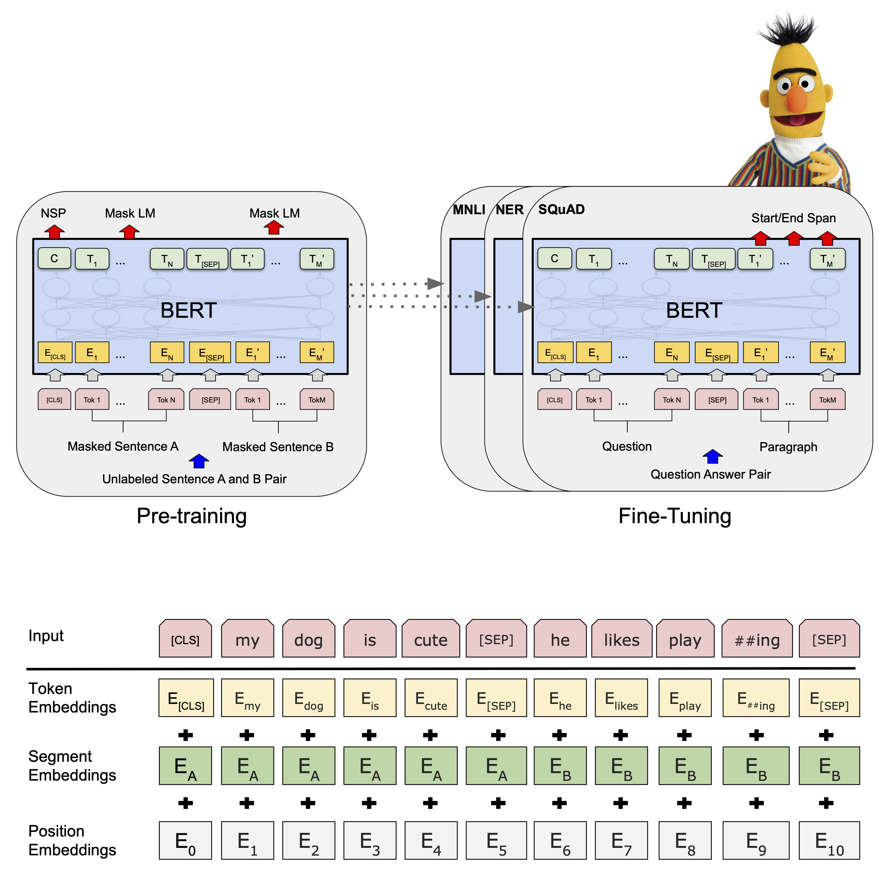

# Sentiment Analysis for Museum Tweets using BERT

A simple sentiment analysis based text classification using Google BERT for museum tweets with HuggingFace Transformers and PyTorch.

## BERT

## Requirements

Did this project on [Google Colab](https://colab.research.google.com).

Python 3 is required.Install requirements using pip package manager.

`pip install -r requirements`